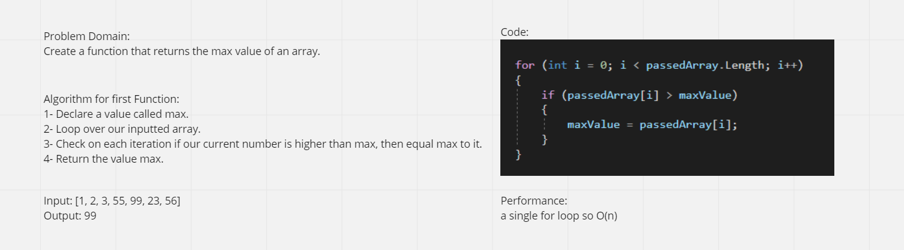

The actual code and solution are in a console app: [Here](./ConsoleApp1)

# Lab03: System.IO

## Description:
Writing a function that would return the Maximum value from inside an array
  

## Whiteboard Process:

  

## Approach & Effeciency:

We loop over an array and compare each element with a value called max, if the iterated value in the array is bigger than our max value, we equal max value with it.  

We use a single for loop so our Big O is O(n).  
